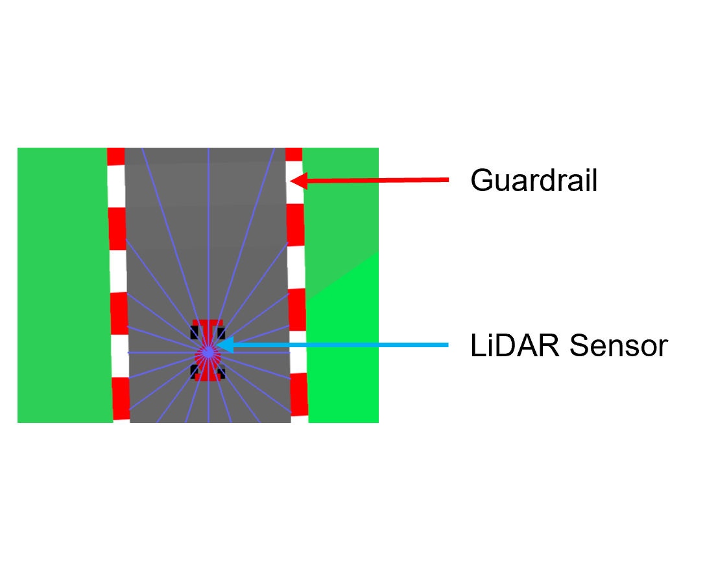

# Autonomous CarRacing
This repo is made for term project of Pusan National University AI system lecture. The environment code is created by modifying `CarRacing-V1` of OpenAI gym library.

## Introduction
<div align=center>


| | |
| --- | --- |
| Action Space | Box([-1. 0. 0.], 1.0, (3,), float32)|
|Observation Shape|(22,)|
|Observation High|(50.,...,50., 1., 1.)|
|Observation Low|(-50.,...,-50., -1., -1.)|
</div>

### Observation Space
- **20 LiDAR Signal (observation[0:20])** : The first 20 signals of the observation are LiDAR measurement data. (Range: -50 to 50)
- **Steering Angle (observation[20])** :  21st signal is steering angle. (Range: -1 to 1)
- **Goal State (observation[21])** : The last signal indicates the goal state. (-1:crush, 0:normal, 1:goal)

### Action Space (Same with original ver.)
- **Steering Angle** : -1 is full left, +1 is full right.
- **Acceleration** : 1 is full accel and 0 is none.
- **Brake** : 1 is full brake and 0 is none.

### Rewards
- In this repo, there are no rewards. The user has to create rewards based on observations and actions.

## Getting started

**a. Create a conda virtual environment and activate it.**
```
conda create -n RL_term -y
conda activate RL_term
```
**b. Install requirements.**

```
pip install pygame
conda install -c conda-forge box2D-python
pip install gym==0.23.1
```
**c. Download repository.**
```
git clone https://github.com/gyeongho-cho/Autonomous_CarRacing.git
cd Autonomous_CarRacing
```
**d. Run tutorial (Manual Control).**
```
pyhton ./tutorial_manual_control.py
```

